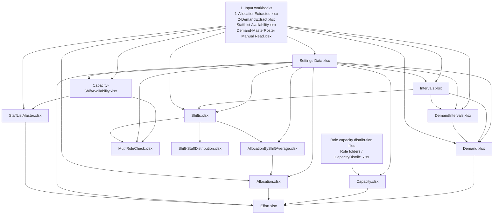

# Residential Care Refresh Order

## Recommended Sequence

1. Input workbooks
2. Settings Data.xlsx
3. Intervals.xlsx
4. DemandIntervals.xlsx
5. Demand.xlsx
6. Capacity-ShiftAvailability.xlsx
7. StaffListMaster.xlsx
8. Capacity.xlsx
9. Shifts.xlsx
10. AllocationByShiftAverage.xlsx
11. Allocation.xlsx
12. Effort.xlsx
13. MutliRoleCheck.xlsx
14. Shift-StaffDistribution.xlsx

## Flowchart

## Notes

- Refresh `Settings Data.xlsx` before dependent calculation workbooks because it provides dates, roles, shifts, meals, shift starts, and permutation dimensions.
- Refresh `Intervals.xlsx` before demand and shift calculations because it supplies the interval spine.
- Refresh `DemandIntervals.xlsx` before `Demand.xlsx`; demand rolls interval-level demand up to shift/date/role outputs.
- Refresh `Shifts.xlsx` before allocation averages and staff distribution outputs.
- Refresh `AllocationByShiftAverage.xlsx` before `Allocation.xlsx`; allocation depends on its role/resource shift summaries.
- Refresh `Effort.xlsx` after demand, capacity, allocation, settings, and staff master data are current.
- `MutliRoleCheck.xlsx` and `Shift-StaffDistribution.xlsx` are downstream diagnostic/reporting workbooks.
