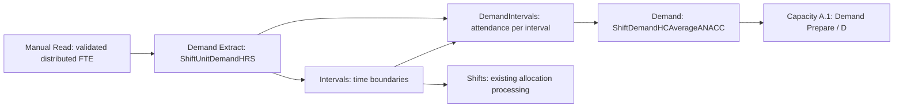

# Demand Extraction: distributed FTE integration plan

Review date: 8 September 2026. Status: review and proposed implementation only.

Change Demand Extraction to consume the validated fortnight allocation from `Demand-MasterRoster Manual Read.xlsx`, while preserving the existing `ShiftUnitDemandHRS` interface. The user has narrowed the initial scope to **RN, AIN and EN** and confirmed a **28-day planning horizon with the fortnight FTE distribution retained**. Repeat the existing two-week pattern twice, preserving each fortnight's amounts. Preserve the selected roles' existing distributed amounts and report the excluded roles separately; do not rescale the retained roles to absorb the excluded hours. Facility scope and the EN/AINC4 mismatch remain to be resolved.

## Scope and evidence

All paths below are relative to `CLIENT/DATExx-Whiddon/UNITS/Unit1/` unless prefixed with `docs/` or `scripts/`.

- Reviewed saved tables in the two requested workbooks: `1. Input/Demand-MasterRoster Manual Read.xlsx` and `1. Input/2-DemandExtract.xlsx`.
- Reviewed their adjacent M sources, the MinuteWorker handoff, path-setup guidance, and downstream M sources.
- Follow-up period review: inspected the saved settings tables, relevant formulas and date extents in `2. Calculations/Settings DataW.xlsx` read-only. This is a separately identified candidate, not an approved replacement for the referenced but missing `Settings Data.xlsx`. Its embedded M was not extracted or compared with the original settings sidecar.
- Keep the M code and workbook structures in `2. Calculations/Demand.xlsx`, `DemandIntervals.xlsx`, `Intervals.xlsx`, `Shifts.xlsx`, and the RN/AIN/AINC4 `CapacityDistrib(A.1)-shifts.xlsx` files unchanged. Their calculated demand values are expected to change when explicitly refreshed later.
- Downstream workbook contents were not inspected. Their adjacent M files establish a provisional dependency contract, not proof of what those workbooks currently contain. Some extraction headers refer to older locations or filenames; exact-workbook verification remains necessary before implementation acceptance.
- No M source or workbook was edited, synchronized or refreshed during this review. No other client, unit, backup or alternate workbook was used as a substitute.

## Findings

### Distributed output is already available in the saved workbook

`MinuteWorkersFTE_TABLE` on the same-named worksheet, range `A1:AS446`, contains 445 allocation rows across BD, JE and TE, two distinct weeks, and seven roles: AIN, CCCM, CSM, EN, RN, RSM and WCSO. Its facility/role/fortnight-day/shift keys are unique and its saved FTE values are non-null and non-negative.

The table is sparse: positive-history cells feed allocation. The saved `MinuteWorkersFTE_HISTORICAL_FORTNIGHT_TABLE`, on `MinuteWorkersFTE_HISTORICAL_FOR!A1:AF883`, provides the complete 882-cell grid, including 437 explicit zero cells. Its `RedistributedRosterFTE` is the allocated measure alongside the original historical measure. Do not interpret every missing row in the sparse allocation table as zero without this coverage evidence.

Saved checks at `MinuteWorkersFTE_CHECK!A1:H1710` contain 1,707 Pass and two Warning rows, with no Error rows. The warnings concern CAM and RGM having no mapped history under the older mapping. The paired profile has 445 PASS and 437 PASS ZERO rows.

Summing saved `FTE * 7.6 * Direct Care %` across each complete fortnight gives these productive-hour totals, consistent with the saved `TargetMinutes!A2:D4` inputs:

| Facility | RN hours | OTHER hours | ALL hours |
| --- | ---: | ---: | ---: |
| BD | 1041.117 | 4139.349666667 | 5180.466666667 |
| JE | 395 | 1559 | 1954 |
| TE | 738 | 2903 | 3641 |

These observations concern saved data. They do not establish a successful refresh of the latest M source.

### The saved output and latest source have different role contracts

The saved allocation still has `QFR Category` and abbreviated roles. The current M source instead reads `MatchingRosterRoleswithANACCRoles` and publishes `DC Role`/`DC Category`, using normalized full DC-role names as `Role`. The mapping table already exists in the workbook, but its presence does not prove its values were used to produce the saved outputs. For the narrowed scope, the intended source-role labels are Registered Nurse, Assistant in Nursing and Enrolled Nurse, presented as RN, AIN and EN in the demand adapter.

The handoff identifies the explicit-mapping revision as source-only and protects that source against extraction of older workbook code over it. Establish the authoritative version and publish matching, validated tables before using the new role contract. Map only the three selected source roles; exclude CCCM, CSM, RSM and WCSO rather than merging their demand into the retained roles.

### Demand Extract is using the historical-hours path

The current source imports `LocRoleDayShift%`, takes `Value` as `DemandHRS`, derives Monday=1 through Sunday=7, and calculates `DemandFTE = DemandHRS / DurationOfShifts`. It does not read the distributed FTE output.

The saved `ShiftUnitDemandHRS!A1:L337` output has 336 rows covering 20 July through 16 August 2026. Demand is populated only for Days 1–7. There are 210 rows with null demand: 84 AINC4 rows, 63 AIN rows and 63 RN rows. All 336 `Facility` values are blank. The populated `Unit` values are BD, JE and TE.

The M code explains the date mismatch: the settings `Day` is a sequential roster-day index, while the historical preparation uses a weekday number. Joining those directly stops matching after Day 7. Both indexes must remain distinct in the replacement.

There is also an import-name mismatch: the saved source's actual Excel table is `LocRoleDayShift`; `LocRoleDayShift%` is its worksheet/query label. The replacement should use the exact named `MinuteWorkersFTE_TABLE` table.

### Analysis-period settings and the confirmed 28-day horizon

The reviewed `Settings Data.xlsx_PowerQuery.m` derives calendar length from allocation dates. No separate `AnalysisDays`, `DateTo`, or fixed 28-day date-generation limit was found in the reviewed active Unit1 sources or saved candidate settings tables.

| Control or query | Location | Effect |
| --- | --- | --- |
| `DateFrom` | Settings M, lines 102–107; candidate `Settings DataW.xlsx`, `Metadata!L9` | Earliest permitted analysis start. The candidate value is **15 July 2024**. |
| `Min Date` | Settings M, lines 16–22; candidate `Metadata!K4` | First eligible allocation date on or after `DateFrom`. The saved candidate output is **20 July 2026**. |
| `DateList` | Settings M, lines 24–42 | Builds every date from `Min Date` through the maximum eligible allocation date, inclusive. The roster data determines the end date. |
| `Table_DateList` | Candidate `Metadata!G1:H29` | Saved output has **28 consecutive dates, 20 July–16 August 2026**, with Day 1–28. |
| `PermutationDimensions` | Settings M, lines 44–53; candidate `DimensionPermutations!A1:E253` | Expands dates by shifts and roles: 28 dates, three shifts, three roles, **84 distinct shift periods**, 252 rows. Demand Extract imports this calendar. |
| `RosterStart` / `RosteredDays` | `1. Input/1-AllocationExtracted.xlsx_PowerQuery.m`, lines 36–50 | Derived minimum date and count of distinct source dates. These describe the roster; they do not impose a fixed duration. The imported roster filename identifies 20 July–16 August 2026. |
| `TargetPeriodDays = 14` | Manual Read M, `MW TargetMinutes Prepare`, line 449 | Retains the fortnight target basis. `MW Fortnight Days` defines two weeks and publication validates exactly two complete historical weeks. Preserve this logic. |

The candidate's `DateFrom` precedes all current allocation dates, so it does not shorten the saved 2026 calendar. Moving `DateFrom` into that calendar would shorten the horizon; importing allocation with later dates could lengthen it. A 28-day requirement therefore needs an explicit acceptance check, even though the current saved calendar already has 28 days.

The confirmed mapping is:

| Planning days | Distribution days | Current saved calendar dates |
| --- | --- | --- |
| 1–14 | 1–14, source Week 1 then Week 2 | 20 July–2 August 2026 |
| 15–28 | 1–14 again, source Week 1 then Week 2 | 3–16 August 2026 |

Use the validated planning start (`Min Date`, currently a Monday) as the Week-1 Monday anchor, not the stale raw `DateFrom` value. Derive the source index as `Number.Mod(Duration.Days([Date] - RosterPatternStart), 14) + 1`. If a future planning start is not a Monday, require an explicit week/day alignment rather than silently shifting the historical pattern. Each source cell appears once in each fortnight; its FTE is neither halved nor doubled. The 28-day sum is twice the included fortnight sum.

Related settings and assumptions do **not** set the calendar horizon:

- Candidate `ShiftHours!A49:C49` contains ordinary hours of **38 per week, 76 per fortnight and 152 per 28 days**. These are workload quantities. The reviewed capacity-availability query returns the weekly value; the 152-hour value does not generate the date range.
- Candidate `ShiftHours!A9:B9` contains `StdWeekDays = 5` and a calculated `ShiftDuration = 7.6` (`38 / 5`). These describe the standard workday conversion, not the planning duration.
- Candidate `MaxCapacity!A9` contains `MaxAvailability = 10`. A.1 caps each resource's summed roster availability using this value. `Capacity-ShiftAvailability` also has a separate M parameter `StdRosterDays = 10`, used in its availability cap and `38 / 10 * 2 = 7.6` conversion. Neither generates the calendar. Do not automatically change either value to 28 or 20; their business meaning requires separate validation against the 28-day capacity population.
- `Demand.xlsx` has `INPUT DateShift = 0`, which offsets dates without changing the number of days. `DaysToRosterStart` calculates another offset, but the reviewed date-shift input does not reference it.
- Three legacy demand checks calculate fields labeled weekly by dividing whole-horizon totals by **2** (`Table_ShiftDemandUnitINTERVALCheck`, `ShiftDemandHCAverageCheck`, `CareDemandHRSWeeklyCheck`). Over a complete 28-day horizon, that gives a fortnight-average amount, not a weekly average. Keep the requested downstream code frozen and use explicit fortnight/28-day reconciliations in Demand Extract. These legacy checks are not reliable weekly acceptance measures for this horizon.

### Downstream demand uses shift-average attendance

The reviewed source path is:



`DemandIntervals` copies `DemandFTE` into numeric `EffectiveIntervalAttendance`. `Demand.xlsx` multiplies that attendance by interval duration and divides the accumulated effort by shift duration. Capacity A.1 consumes the resulting `ShiftDemandHCAverage` as `D`.

Consequently the interface must retain:

```text
DemandHRS = source FTE * 7.6
DemandFTE = DemandHRS / DurationOfShifts
```

`DurationOfShifts` is the existing role/shift span in hours. It must agree with `EndTime - StartTime`. For example, one source FTE represents 7.6 roster hours; across an 8.25-hour shift, downstream attendance is approximately 0.921212. Copying 1 directly into `DemandFTE` would instead produce 8.25 hours. Do not apply Direct Care % again to roster demand; use it only to reconcile productive-care targets. Keep full precision.

`Demand.xlsx` casts its imported `DemandFTE` column to `Int64.Type`, but the reviewed route to A.1 uses the separate numeric `EffectiveIntervalAttendance` field. Fractional demand can therefore reach A.1 without editing that cast. The cast remains a limitation for other consumers of that diagnostic column and must be acknowledged in validation.

### The model scope must be explicit

The user has selected RN, AIN and EN for this first implementation. The existing saved demand calendar and reviewed capacity sources instead use RN, AIN and AINC4. EN must not be silently renamed to AINC4 or lost in the calendar join. Confirm whether the AINC4 slot is an agreed legacy representation of EN, or whether an EN model already exists. If neither is true, supporting EN requires a downstream scope decision; changing the extraction alone cannot make the AINC4 role filter accept EN.

The other source roles are intentionally excluded from this initial interface. Preserve the retained allocations as calculated upstream. The three-role productive-hour total will generally be below the full RN+OTHER target because the excluded roles have allocated demand. Reallocating that full target to three roles would be a separate business-logic change.

A.1 filters by role, then uses period-only demand joins and drops Facility from its period-demand interface. Passing several independent facilities through those joins would create multiple demand rows per period. Preserve one agreed modeled population: a single facility, or an explicitly approved aggregation whose staff capacity covers the same population. Distinct capacity results for all facilities cannot be promised under an extraction-only change without confirming existing downstream support.

## Proposed implementation

1. **Establish the exact source and dependencies.** Reconcile workbook/M versions through the approved IMPORT Extract process before editing. Preserve the intentional Manual Read source changes. Confirm the approved Demand Extract work-file location for this business change; the path-migration exception alone is not authority to overwrite a newer workbook. The required `2. Calculations/Settings Data.xlsx` currently does not exist at its referenced path. Resolve that exact dependency before validation; do not silently substitute `Settings DataW.xlsx`.

2. **Import the published allocation once.** Add a shared buffered import of the exact Manual Read workbook using the existing `Unit1Path` resolver. Read the named allocation, complete-grid profile and check tables from it. Reject missing required tables/columns, failed checks, invalid numbers, duplicate keys and incompatible source schema. Cross-check the allocation and profile values and zero coverage so a stale or mismatched table does not silently supply demand.

3. **Prepare the three selected roles.** Create a separate `Distributed FTE Prepare` query. Preserve source facility, DC role, category, Direct Care %, original week and fortnight-day keys for audit. Select Registered Nurse/RN, Assistant in Nursing/AIN and Enrolled Nurse/EN using the established source version's exact mapping. Translate `NS` to `NIGHT`. Apply the agreed facility scope and resolve EN's destination role explicitly. Keep the retained FTE amounts unchanged; report excluded roles and their hours without reallocating them. Reject unexpected unmatched values within the selected scope.

4. **Repeat the fortnight across 28 calendar days.** Create `Demand Calendar Prepare` from the existing settings permutation. Require exactly 28 consecutive planning dates and preserve `Date`, sequential `Day`, `Period` and role/shift timing. Use the validated planning-start Monday as the source Week-1 anchor and derive a separate `FortnightDayIndex` using the date offset modulo 14. Join by mapped role, fortnight day and shift. Days 15–28 repeat the source allocation for Days 1–14. Do not average the two source weeks, divide a fortnight's allocation over 28 days, or join on sequential `Day` as a weekday. Reject a shorter or longer settings calendar rather than silently padding or truncating it.

5. **Publish the existing interface.** Prepare complete calendar/role/shift rows, using explicit validated zeros where appropriate. Populate Facility and Unit according to the agreed model scope. Carry the settings shift span even on zero-demand rows so interval boundaries stay complete. Calculate the two measures above and preserve the `ShiftUnitDemandHRS` query, Excel table and worksheet name, headers at row 1, and these exact columns in order:

   `Date, Day, Shift, Period, Role, StartTime, EndTime, Unit, Facility, DemandFTE, DemandHRS, DurationOfShifts`.

6. **Expose checks and gate publication.** Add `DemandExtraction_CHECK` for schema, mapping, dates, duplicate joins, missing cells, durations and hours reconciliation. Make `ShiftUnitDemandHRS` fail visibly on required failures. Keep preparation queries separately named, in dependency order, and connection-only where supported. Add the required `// Query:` and `// Purpose:` headers and comments explaining units, date mapping, zero handling and aggregation.

## Acceptance and later workbook validation

- Each selected modeled role/period has exactly one demand value after the agreed facility treatment. EN reaches the explicitly agreed third role interface. No joins multiply demand unexpectedly.
- Every source cell is included once per intended cycle or has a documented, approved exclusion. All zeros have coverage evidence; missing mappings remain errors.
- The planning calendar has exactly 28 consecutive dates and 84 distinct shift periods for three shifts per day. Week 1 and Week 2 remain distinct and repeat as Week 3 and Week 4. The modulo mapping is 1→1, 14→14, 15→1, 28→14. Dates, period IDs, shift boundaries, overnight end dates and output schema satisfy the existing downstream contract.
- Per cell, `DemandFTE * DurationOfShifts = DemandHRS`, and `DemandHRS / 7.6` reconstructs the included source FTE.
- Per retained source role and complete 14-day cycle, roster hours reconcile to that role's published distributed FTE times 7.6. Reconcile included plus excluded productive hours to the complete upstream RN and ALL-minus-RN targets; do not require the three-role subset alone to equal the full target. A repeated 28-day horizon totals two included cycles; do not compare that total to one fortnight's target. Preserve source-role Direct Care % in the audit.
- Review the final M dependency order, headers, comments, step names and `in` targets. The existing MinuteWorker fixture suite passed 544 arithmetic/source-contract assertions during this review; it does not execute M or validate an Excel refresh.
- After explicit authorization for the named synchronization and refresh operations, verify exact downstream workbook contracts and refresh the required dependency sequence. For demand: Demand Extract, Intervals where required, DemandIntervals, Demand, then the relevant A.1 model after its other dependencies are current. Any Shifts/allocation refresh remains subject to its own dependency requirements. This plan does not authorize full-workflow automation.
- Compare interval-integrated hours and A.1 `D` against the expected shift-average demand, including a fractional example, unequal weeks, a zero cell and an overnight shift. Verify frozen downstream M code remains unchanged. Re-extract any synchronized target through the approved mechanism and compare it with its approved source.

## Decisions still required

- Calendar duration and repetition are confirmed: 28 days containing two unchanged fortnight distributions. Verify the authoritative calendar start before implementation; the inspected candidate starts Monday, 20 July 2026.
- Which facility or combined population Unit1 models, including the meaning of Facility and Unit at the interface.
- Whether the existing AINC4 slot represents EN, or an EN model already exists. The selected business roles are confirmed as RN, AIN and EN; the other roles are excluded for this initial implementation.
- The authoritative Manual Read publication and the intended exact Settings Data dependency.

The recommended boundary is to make Demand Extract the conversion layer and keep its published interface stable. Implementation should begin once these business and source-version decisions are resolved.
