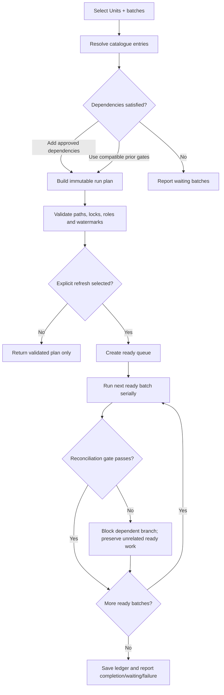

# ResidentialCare batch runner plan

## Recommendation

Place the new selection and orchestration layer at the `DATExx-Whiddon` Date root, beside the existing top-level runner.

That layer is the correct place to combine:

- user-selected `UnitN` folders;
- user-selected Unit batches;
- cross-unit reconciliation barriers; and
- organisation/EOI batches that run only after the required Units are ready.

The Date-level runner should plan and validate the work. Existing Unit and organisation workflow components should continue to execute individual workbook refreshes and enforce Excel safety.

## Proposed entry point

Add a new entry point without changing the behaviour of the existing production command initially:

`CLIENT/DATExx-Whiddon/Run-BatchRefreshRunner.cmd`

The command would call a Date-level planner such as:

`CLIENT/DATExx-Whiddon/runner/Invoke-BatchRefreshRunner.ps1`

Keep `Run-RefreshRunner.cmd` unchanged until the batch runner has passed validation-only testing and an approved controlled refresh trial.

## User control model

The primary operating instruction should be **run all**. It validates and runs the complete approved Date-level workflow in dependency order: every selected Unit batch, the all-Unit reconciliation barrier, and every organisation/EOI batch.

Batch IDs are the normal manual-control option when the operator wants less than a complete run. Existing individual-workbook, start-workbook and sequence-range controls remain available for precise intervention and diagnostics.

The control hierarchy is:

1. **Run all** — the normal production action.
2. **Run selected batches** — the common manual override.
3. **Run an individual workbook or sequence range** — expert-level targeted control retained from the existing runner.

Units are an optional scope selector. If no Unit selection is supplied to `run all`, the runner uses all discovered and approved Units.

```text
Run-BatchRefreshRunner.cmd -RunAll
Run-BatchRefreshRunner.cmd -Units Unit1,Unit2 -Batches D1,A1,S1
Run-BatchRefreshRunner.cmd -Units Unit1 -Batches D2,A2,A3
Run-BatchRefreshRunner.cmd -Units All -Batches C2,U4
Run-BatchRefreshRunner.cmd -Units All -Batches O1,O2,O3,O4,O5
Run-BatchRefreshRunner.cmd -Units Unit1 -StartAtWorkbook "Intervals.xlsx"
Run-BatchRefreshRunner.cmd -StartAtSequence 12 -EndAtSequence 18
```

Recommended controls:

| Control | Purpose |
|---|---|
| `-RunAll` | Validate and run the complete approved Date-level workflow. This is the default production control. |
| `-Units Unit1,Unit2` | Select explicit Units. `All` expands discovered and approved `UnitN` folders. |
| `-Batches D1,A1` | Select one or more named batches. Batch IDs are stable; workbook sequence numbers remain internal. |
| `-IncludeDependencies` | Add missing upstream batches needed to reach the requested batch. |
| `-ReadyOnly` | Run only selected batches whose prerequisites and data watermarks are currently satisfied. Report the rest as waiting. |
| `-ValidateSelectionOnly` | Resolve, display and validate the complete work plan without opening Excel. |
| `-RefreshSelected` | Explicitly authorise refresh of the validated selection. No refresh occurs without this switch. |
| `-ShowPlan` | Print the resolved Units, batches, files, gates and execution order. |
| `-ResumeRun <RunId>` | Resume from the first incomplete batch using the saved run ledger. |
| `-VisibleOverride true` | Preserve the existing optional visible-Excel behaviour. Hidden remains the default. |
| `-TimeoutMinutesOverride 30` | Preserve the existing per-workbook timeout control. |
| `-StopMode AfterCurrent|Now` | Preserve the existing stop controls. |

The selection modes are mutually exclusive:

- `-RunAll`;
- `-Batches`;
- `-StartAtWorkbook`; or
- `-StartAtSequence` with optional `-EndAtSequence`.

Do not combine them in one request. Units may qualify `-RunAll`, `-Batches`, or an unambiguous Unit workbook selection. Existing global sequence selection remains Date-level.

## Natural-language command contract

| User instruction | Interpretation |
|---|---|
| `run all` | Use all approved Units and execute every Unit and organisation batch in dependency order. |
| `run all for Unit1` | Execute all Unit batches for Unit1. Do not run organisation batches unless explicitly included or the command says to continue through organisation outputs. |
| `run D1 and A1 for Unit1 and Unit2` | Execute the named batches for the two Units. Validate dependencies and gates first. |
| `run O1 to O5 for all units` | Confirm compatible R4 releases for all approved Units, then run organisation batches O1–O5 once. |
| `run from Intervals.xlsx for Unit1` | Use the retained workbook-level control and continue from the uniquely resolved Unit1 workbook. |
| `run 12 to 18` | Use the retained Date-level global sequence range. |
| `validate all` | Resolve and validate the same plan as `run all`, without opening Excel. |
| `show plan` | Display resolved Units, batches, files, gates and ordering without refreshing. |

As with the existing runner, every refresh instruction first performs validation. `Validate`, `show`, `preview` and `check` never authorise Excel refresh.

## Batch catalogue

Store batch definitions in one Date-level PowerShell data file, for example:

`CLIENT/DATExx-Whiddon/runner/ResidentialCare-BatchCatalogue.psd1`

Each batch entry should declare:

- stable batch ID and display name;
- scope: `Unit` or `Organisation`;
- ordered workbook references;
- prerequisite batch IDs;
- reconciliation gate released by the batch;
- required support files;
- whether the batch is independently runnable;
- whether it can run concurrently with peer batches; and
- output watermark/check names required for release.

The catalogue should reference workbook IDs from the existing Unit and organisation manifests. It should not repeat paths in a second independent list. This keeps the current manifests authoritative for filenames and sequence order.

`Demand-MasterRoster Manual Read.xlsx` needs an approved workbook entry or approved pre-sequence transformation entry before D1 becomes executable. It is shown in the staging design but is not currently part of the authoritative 24-workbook Unit manifest.

## Selection semantics

### Run all

`-RunAll` expands to the entire approved batch graph rather than translating to a manually maintained numeric range. By default it executes the resolved batches serially in their configured order. The resolved plan should normally be:

1. all Unit-scoped batches for every approved Unit;
2. R4 per Unit;
3. R5 across all included Units;
4. O1 through O5; and
5. the final completion report.

The initial runner should keep `run all` fully serial. A later approved scheduler may advance independent ready branches differently, but the observable result must remain equivalent to completing every approved batch and reconciliation gate.

### Unit batches

Unit batches run only for the Units selected by the user:

- `D1`, `A1`, `S1`, `C1`, `D2`, `A2`, `A3`;
- `C2`, dynamically expanded as `C2.1` through `C2.N` for the enabled role folders in the saved client role profile; and
- `U4`.

Example: `-Units Unit1,Unit2 -Batches D1` means D1 for Unit1 and D1 for Unit2.

### Organisation batches

Organisation batches are Date-level and run once:

- `O1`, `O2`, `O3`, `O4`, `O5`.

When any `O*` batch is selected, the Unit selector defines which Units must satisfy R5. It does not cause the organisation workbook to run once per Unit.

Example: `-Units Unit1,Unit2 -Batches O1,O2` means confirm that Unit1 and Unit2 have compatible R4 releases, then run O1 and O2 once.

### Mixed selection

A user may select Unit and organisation batches together. The planner expands them into a dependency graph and inserts the R5 barrier between them.

Example:

```text
-Units Unit1,Unit2 -Batches U4,O1,O2 -IncludeDependencies
```

The planner resolves required upstream Unit work, completes U4 for both Units, verifies compatible release watermarks, then permits O1 and O2.

## Progress-as-far-as-possible behaviour

Use dependency-aware scheduling rather than one global contiguous sequence.

1. Resolve the requested Units and batches.
2. Expand dependencies only when `-IncludeDependencies` is present.
3. Validate every resolved workbook, support file, role profile and Unit path before refresh.
4. Build a ready queue from batches whose prerequisites are satisfied.
5. Execute ready batches while preserving serial workbook order inside each batch.
6. Re-evaluate the ready queue after each batch completes.
7. Stop a failed branch at its next gate, but allow unrelated ready branches to continue when Excel isolation and the approved concurrency policy permit it.
8. Record waiting, succeeded, failed, skipped and blocked states in the run ledger.
9. Release downstream work only when its reconciliation gate passes for compatible data watermarks.

For the first production version, execute one workbook at a time even when two branches are logically independent. Dependency-aware scheduling still provides useful progress without introducing concurrent Excel processes. Parallel execution can be considered separately after the serial batch runner is stable.

## Reconciliation gates

| Gate | Required condition |
|---|---|
| **R1** | D1, A1 and S1 are successful for the same Unit and compatible watermark. |
| **R2** | D2, A2, C1 and S1 are successful for the same Unit and compatible watermark. |
| **R3** | Every expanded role-capacity batch from C2.1 through C2.N is successful and its checks pass. |
| **R4** | U4 succeeds and demand, allocation and capacity checks pass for the Unit. |
| **R5** | Every Unit selected for the organisation run has a compatible R4 release. |
| **R6** | O3 and O4 succeed before O5 is released. |

Selecting a downstream batch without its prerequisites should never silently run against unverified state. The runner must either:

- add prerequisites because `-IncludeDependencies` was specified;
- accept previously completed compatible gates from the ledger; or
- report the batch as waiting/blocked without opening Excel.

## Run plan and ledger

Before execution, persist a resolved immutable plan containing:

- run ID;
- selected Units and batches;
- dependency expansion decisions;
- ordered workbook list per batch;
- manifest and catalogue versions or hashes;
- input and output watermarks;
- validation results; and
- requested execution controls.

During execution, maintain one ledger row per Unit/batch pair and one row per organisation batch. Suggested states:

`PLANNED`, `READY`, `RUNNING`, `SUCCEEDED`, `FAILED`, `WAITING`, `SKIPPED`, `STOPPED`.

The ledger enables reliable status reporting and `-ResumeRun` without inferring state solely from workbook modification times.

## Validation rules

The batch runner must retain all existing safety checks and add batch-specific validation:

- selected Units exist and match `UnitN` naming;
- exactly one selection mode is active: all, batches, workbook, or sequence range;
- batch IDs exist and are valid for their scope;
- enabled roles match the saved client role profile;
- workbook references resolve through the authoritative manifests;
- no selected workbook is missing, open, locked or outside its approved root;
- prerequisite gates are selected or already satisfied;
- all gate watermarks are compatible;
- organisation batches are never expanded once per Unit;
- no overlapping runner is active; and
- validation-only mode never opens Excel.

## Delivery phases

### Phase 1 — Catalogue and plan preview

- Add the batch catalogue.
- Add `-RunAll`, Unit, batch and retained workbook/range selection parsing.
- Resolve dependencies and generate a plan.
- Implement `-ShowPlan` and `-ValidateSelectionOnly` only.
- Add tests for Unit selection, organisation selection, mixed selection and invalid combinations.

### Phase 2 — Serial batch execution

- Reuse the existing workbook refresh engine.
- Execute one batch and one workbook at a time.
- Add the run ledger, gate states, stop handling and resume support.
- Perform controlled validation-only tests, followed by a separately approved narrow refresh trial.

### Phase 3 — Readiness and watermarks

- Define approved source arrival checks.
- Add per-branch input and output watermarks.
- Implement `-ReadyOnly` and compatible-gate reuse.
- Confirm that stale or mixed-cycle data cannot pass a gate.

### Phase 4 — Watch-and-trigger mode

- Add watchers only after the source-of-truth workflow and arrival contract are approved.
- Debounce partially copied files and require file stability.
- Convert an arrival into a validated batch request, not a direct workbook refresh.
- Keep explicit enable/disable, audit logging, retry limits and manual override controls.

### Phase 5 — Optional concurrency

- Evaluate isolated branch execution only after serial operation is proven stable.
- Keep workbook order serial inside every batch.
- Never run batches concurrently when they may access the same workbook, Excel instance, output file or lock scope.

## Proposed operator flow



## Approval boundary

This is a design plan only. It does not authorise a new refresh implementation, workbook changes, M-code synchronisation, watcher creation or any Excel execution.
