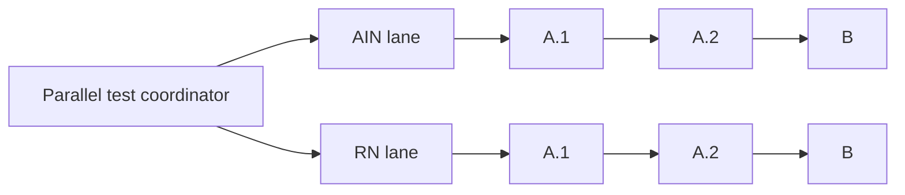

# ResidentialCare Parallel Role Refresh Test Plan

## Seven-lane scale-out

After the repeated two-lane tests and the successful three-lane workload, the
isolated harness is configured for seven concurrent Unit1 lanes: `AIN`,
`AINC4`, `RN`, and `TestRole1` through `TestRole4`. Each test role contains
byte-identical copies of the three latest AIN workbooks. A full test therefore
selects 21 workbooks while keeping each role's three workbooks sequential.

This scale-out remains isolated from the production client role profile and
production runner. The harness records five-second memory samples. It also
recognises the narrow case where the worker confirms save and close, its final
temporary state says `Complete`, and the owned Excel process has exited, even
if the supervisor saw the preceding `Quitting` state because the final state
file replacement was briefly blocked. Do not run Git status, indexing, or
other repository scans while a live parallel refresh is active.

## Objective

Prove that two Unit1 role folders can refresh concurrently without mixing files,
logs, process ownership, stop controls, or saved results. Each role remains a
sequential three-workbook lane:

1. `CapacityDistrib(A.1)-shifts.xlsx`
2. `CapacityDistrib(A.2)-shifts.xlsx`
3. `CapacityDistrib(B)-shifts.xlsx`

The first test pair is `AIN` and `RN`. Their matching filenames provide a strong
full-path isolation test.

## Non-negotiable boundary

Do not modify existing runner PowerShell, command files, manifests, or client
profiles. Build the experiment as a separate additive package under:

`CLIENT/DATExx-Whiddon/UNITS/parallel-test/`

The new package may call the existing per-workbook worker at
`UNITS/runner/src/Invoke-ExcelWorkbookRefresh.ps1` through its published
parameters. It must not call or bypass the existing all-units workflow lock.

## Proposed new files

- `UNITS/Run-ParallelRoleRefreshTest.cmd`
  - Thin entry point for the test package.
- `UNITS/parallel-test/Invoke-ParallelRoleRefreshTest.ps1`
  - Coordinator, validation, monitoring, stop handling, and final report.
- `UNITS/parallel-test/Invoke-ParallelRoleLane.ps1`
  - Runs one role's three files sequentially.
- `UNITS/parallel-test/ParallelRoleTest.psd1`
  - Explicit Unit1 test scope, default roles `AIN` and `RN`, workbook order,
    concurrency limit of two, and timeout settings.
- `scripts/test-parallel-role-refresh-harness.ps1`
  - Mock-process tests that never open Excel.

## Execution model

- Start exactly two lane processes.
- Start exactly one Excel process per lane.
- Within a lane, do not start the next workbook until the worker confirms save,
  close, Excel quit, and owned Power Query process exit.
- Never run the same full workbook path in both lanes.
- Identify workbooks by canonical full path. The filename alone is never an
  identity or lock key.

## Isolation design

Create a unique run directory for every test:

`UNITS/RunLogs/ParallelRoleTests/<run-id>/`

Inside it, create separate `AIN/` and `RN/` directories. Each lane receives its
own:

- log file;
- current-status file;
- stop-request file;
- worker-state files;
- process ID and start-time records;
- result summary.

The coordinator receives a separate coordinator log, status, stop file, and lock.
It must not write to the existing `current-status.txt`, `latest-log.txt`,
`stop-request.txt`, or `AllUnitsRefresh.lock`.

Use a test-only lock keyed from each canonical workbook path. Reject duplicate
paths before any Excel process starts. Existing Excel lock files and external file
users remain validation failures.

## Validation gate

Before each test:

1. Confirm no existing ResidentialCare runner or parallel test is active.
2. Load the saved client profile and existing role manifest read-only.
3. Confirm `AIN` and `RN` are enabled and each has the exact three configured files.
4. Confirm all six paths resolve beneath Unit1 and are unique.
5. Confirm no workbook has an Excel `~$` lock file or external file user.
6. Confirm the two lanes do not share a writable output path.
7. Confirm any shared upstream inputs are read-only for both lanes.
8. Print the six canonical paths and lane order before Excel starts.

If dependency independence cannot be established from approved source/configuration,
stop before the full parallel test. Do not inspect or alter workbook internals as a
shortcut.

## Test stages

### Stage 1: harness dry run

- Resolve the two lanes and print their exact paths.
- Create isolated run directories and state files.
- Start mock workers instead of Excel.
- Prove simultaneous starts, sequential advancement within each lane, independent
  stops, timeout handling, and final cleanup.

### Stage 2: sequential control

- Run the six workbooks with the new harness at concurrency one.
- Record validation, open, refresh, readiness, save, close, and process-exit times.
- Preserve this as the direct performance and result baseline.

### Stage 3: matching-name pair

- Run only the AIN and RN `CapacityDistrib(A.1)-shifts.xlsx` workbooks concurrently.
- Confirm each log and status names the correct full path.
- Confirm both save and close and no owned processes remain.
- Compare results with their Stage 2 control runs.

### Stage 4: full two-lane test

- Run all three AIN files sequentially in lane A.
- Run all three RN files sequentially in lane B.
- Maintain maximum concurrency two.
- If either lane fails, request the other lane to stop after its current workbook.
  Preserve the successful workbook and failure evidence.

### Stage 5: repeatability

- Repeat Stage 4 at least twice.
- Do not expand beyond two lanes until both repeats pass.

## Monitoring

Sample every five seconds and retain:

- lane and workbook phase;
- owned Excel and Power Query PIDs;
- elapsed time per workbook and lane;
- process CPU and working set;
- system available memory;
- save confirmation and exit code.

The coordinator prints a combined view but never merges the underlying lane logs.

## Stop behaviour

- `Stop lane A now` affects only lane A's stop file and owned processes.
- `Stop lane B now` affects only lane B.
- `Stop all now` writes both lane stop files.
- `Stop all after current` lets each active workbook finish, then prevents the next
  workbook in each lane from starting.
- Never terminate Excel by process name. Match owned PID, process name, and process
  start time.

## Acceptance criteria

The parallel design passes only when:

- all six intended Unit1 workbooks are selected exactly once;
- same-named workbooks remain associated with their correct full paths;
- all six refresh, save, close, and exit successfully;
- original background-refresh settings are restored before every save;
- there are no lock, access-denied, RPC, or shared-state collisions;
- no owned Excel or Power Query process remains;
- refreshed outputs match the sequential control;
- two repeated full tests pass;
- parallel wall time is lower than the sequential control without a material
  regression in individual workbook duration.

## Rollback

The package is isolated and additive. Rollback consists of removing the new
`parallel-test` package and its test-only logs after review. Existing production
runner files remain untouched throughout development and testing.
