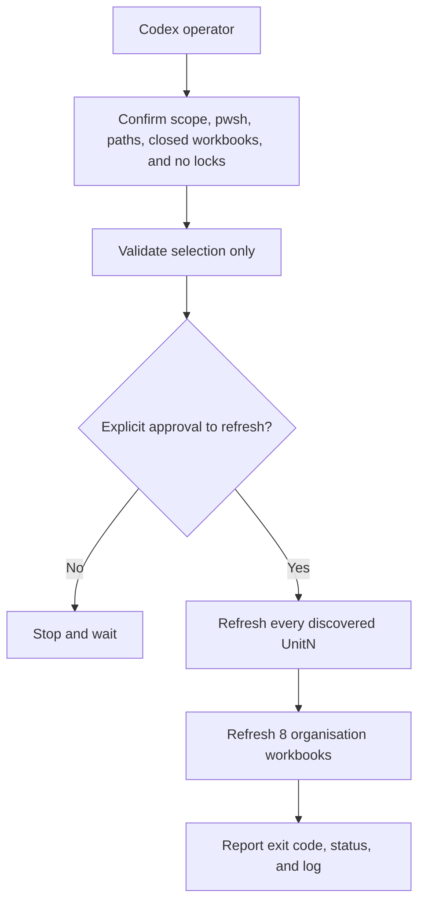

# ResidentialCare runner sequence maps

These maps describe the executable order in the copied runner `.psd1`
manifests. They are distinct from a Power Query dependency-lineage diagram:
an arrow here means **refresh next**, not necessarily **reads data from**.

## Operator and top-level flow

See [ResidentialCare-Runner-Overview.mmd](ResidentialCare-Runner-Overview.mmd)
for the standalone Mermaid source.

## Unit 1 full sequence

The full Unit 1 runner executes 24 workbooks in this order:

1. `1. Input/1-AllocationExtracted.xlsx`
2. `1. Input/2-DemandExtract.xlsx`
3. `2. Calculations/Settings Data.xlsx`
4. `2. Calculations/Intervals.xlsx`
5. `2. Calculations/DemandIntervals.xlsx`
6. `2. Calculations/Demand.xlsx`
7. `2. Calculations/Capacity-ShiftAvailability.xlsx`
8. `2. Calculations/StaffListMaster.xlsx`
9. `2. Calculations/Shifts.xlsx`
10. `2. Calculations/AllocationByShiftAverage.xlsx`
11. `2. Calculations/Allocation.xlsx`
12. `2. Calculations/Shift-StaffDistribution.xlsx`
13. `2. Calculations/MutliRoleCheck.xlsx`
14. `2. Calculations/AIN/CapacityDistrib(A.1)-shifts.xlsx`
15. `2. Calculations/AIN/CapacityDistrib(A.2)-shifts.xlsx`
16. `2. Calculations/AIN/CapacityDistrib(B)-shifts.xlsx`
17. `2. Calculations/AINC4/CapacityDistrib(A.1)-shifts.xlsx`
18. `2. Calculations/AINC4/CapacityDistrib(A.2)-shifts.xlsx`
19. `2. Calculations/AINC4/CapacityDistrib(B)-shifts.xlsx`
20. `2. Calculations/RN/CapacityDistrib(A.1)-shifts.xlsx`
21. `2. Calculations/RN/CapacityDistrib(A.2)-shifts.xlsx`
22. `2. Calculations/RN/CapacityDistrib(B)-shifts.xlsx`
23. `2. Calculations/Capacity.xlsx`
24. `2. Calculations/Effort.xlsx`

See [ResidentialCare-Unit1-Sequence.mmd](ResidentialCare-Unit1-Sequence.mmd)
for the complete left-to-right Mermaid flow.

## Unit 1 narrower runners

- Stage 1, RN only: the three RN workbooks corresponding to full-sequence
  positions 20–22.
- Stage 2, all roles: AIN, AINC4, and RN workbooks corresponding to positions
  14–22.
- Stage 3, unit calculations: 22 entries beginning with `Settings Data.xlsx`
  and ending with `Effort.xlsx`. This stage has its own sequence numbers and
  omits the three leading input refreshes and `2-DemandExtract.xlsx`.
- Stage 4, Unit 1 only: the complete 24-workbook sequence above.

## Organisation sequence

After the units, the top-level runner executes:

1. `2. Calculations/E-O-I/StafMasterList-All.xlsx`
2. `2. Calculations/E-O-I/Effort-All.xlsx`
3. `2. Calculations/E-O-I/EffortOutcomes.xlsx`
4. `2. Calculations/E-O-I/Inefficiencies.xlsx`
5. `2. Calculations/Cost/Cost..xlsx`
6. `2. Calculations/EOW/EffortOutcomeLogXY.xlsx`
7. `2. Calculations/EOW/2DRead.xlsx`
8. `2. Calculations/Tableau Connection.xlsx`

It also requires `AllocationChange.xlsx`, `Grid Thresholds.xlsx`, and Unit 1's
`Settings Data.xlsx` to exist. See
[ResidentialCare-Org-Sequence.mmd](ResidentialCare-Org-Sequence.mmd).

## Important distinction

The older root-level `RefreshOrder_Flowchart.md` is a conceptual dependency
map. Its recommended order is not identical to the executable runner manifest.
For operating the `.cmd` runner, the `.psd1` manifests and the maps in this
document are authoritative.
